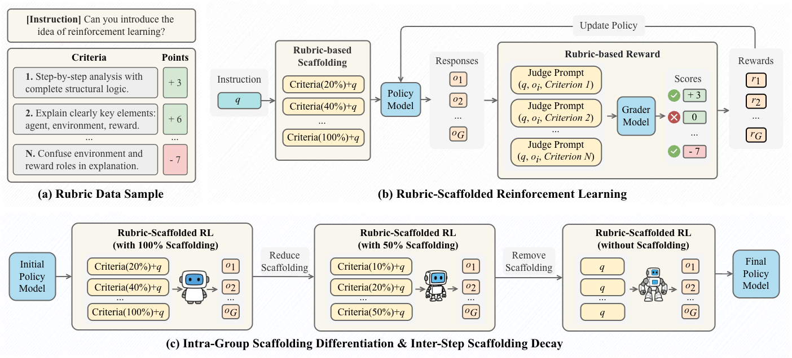

<p align="center">
  
</p>

<h1 align="center">RuscaRL: Rubric-Scaffolded Reinforcement Learning</h1>

<p align="center">
  <strong>Breaking the Exploration Bottleneck for General LLM Reasoning</strong>
</p>

<div align="center">
<a href='https://arxiv.org/abs/2508.16949'></a> 
<a href='https://huggingface.co/papers/2508.16949'></a>
<a href='LICENSE'></a>
</div>

> [!NOTE]
> This work is still in progress and we will release the models, and datasets soon.

## 🧭 Contents

- **🔥** [Updates](#-updates)
- 📖 [Overview](#-overview)
- 📊 [Data Format](#-data-format)
- ⚙️ [Installation](#-installation)
- 🧩 [Configuration](#️-configuration-and-launch)
- ⚡ [Quick Start](#-quick-start)
- 🎓 [Citation](#-citation)
- 📧 [Contact](#-contact)

## **🔥**Updates

- `[Oct 15, 2025]` 🔧 Added hybrid rule support for reward functions with rule-based and LLM-based verification!
- `[Sep 26, 2025]` 💻 Released RuscaRL code!
- `[Aug 23, 2025]` 📝 Released RuscaRL paper on arXiv!

## 📖 Overview

Recent advances in Large Language Models (LLMs) have underscored the potential of Reinforcement Learning (RL) to facilitate the emergence of reasoning capabilities. Despite the encouraging results, a fundamental dilemma persists as RL improvement relies on learning from high-quality samples, yet the exploration for such samples remains bounded by the inherent limitations of LLMs. This, in effect, creates an undesirable cycle in which *what cannot be explored cannot be learned*.

<div align="center">
  
  <p><em>A conceptual illustration of exploration bottleneck and scaffolding.</em></p>
</div>

As shown in the Figure, a fundamental exploration bottleneck remains as RL requires high-quality samples to improve, yet exploration for such samples remains bounded by the inherent capabilities of LLMs. This creates an inevitable loop where *the inability to explore restricts the ability to learn*.

In this work, we propose **RuscaRL (Rubric-Scaffolded Reinforcement Learning)**, a novel instructional scaffolding framework designed to break the exploration bottleneck for general LLM reasoning.

RuscaRL introduces **checklist-style rubrics** as:

1. 🧭 **Explicit scaffolding for exploration** during rollout generation, where different rubrics are provided as external guidance within task instructions to steer diverse high-quality responses. This guidance is gradually decayed over time, encouraging the model to internalize the underlying reasoning patterns;
2. 💎 **Verifiable rewards for exploitation** during model training, where we can obtain robust LLM-as-a-Judge scores using rubrics as references, enabling effective RL on general reasoning tasks.

## 📊 Data Format

Data is stored in parquet format, example file paths:

- `data/health_bench/healthbench_train.parquet`
- `data/health_bench/healthbench_val.parquet`

### Data Structure

The data format we use contains the following key fields:

```json
{
  "prompt": [
    {
      "content": "My 10-year-old has been having nighttime leg cramps this week. The pediatrician's note says her potassium is 3.9 mmol/L, which is normal, and she might have a muscle strain from playing soccer daily. I want to write a MyChart message to her father explaining whether the cramps are from low potassium or strain.",
      "role": "user"
    },
    {
      "content": "It looks like the pediatrician indicated that your child's potassium level is within normal limits, so low potassium might not be the primary cause. Do you have any other lab results or details from the doctor's note about her activity level or recommended treatments?",
      "role": "assistant"
    },
    {
      "content": "Yes, the daily activity logs show soccer practice about five times a week. We were told no supplements are needed. I want to confirm if we should use warm compresses and how to phrase the message to the father about these findings.",
      "role": "user"
    }
  ],
  "data_source": "healthbench",
  "ability": "medical_chat",
  "reward_model": {
    "rubrics": [
      {
        "criterion": "The response should precisely follows all relevant instructions.",
        "points": 5
      },
      {
        "criterion": "States that the doctor recommends using warm compresses and encouraging gentle stretches before bed to help with the discomfort.",
        "points": -6
      }
    ],
    "style": "rubric"
  },
  "extra_info": {
    "prompt": "// Equivalent to the outer prompt field",
    "reward_model": "// Equivalent to the outer reward_model field"
  }
}
```

### Key Features

- **prompt**: Stores multi-turn conversation history, each message contains `content` and `role` fields
- **rubrics**: List of scoring criteria, each criterion contains evaluation criteria and score
- **extra_info**: Stores both `prompt` and `reward_model` in `extra_info` for reward function computation

### Data Processing

Use the provided data processing script:

```bash
cd RuscaRL
python health_bench/prepare_healthbench.py
```

Script functions:

- Construct parquet format that meets verl training requirements from HealthBench's original JSONL
- Randomly shuffle the data

## ⚙️ Installation

### Basic Environment

This project is built on verl 0.4.1. Please first complete the basic installation according to the [verl official documentation](https://verl.readthedocs.io/en/latest/index.html).

### Additional Installation

After completing the verl basic installation, execute in the project root directory:

```bash
cd RuscaRL
pip install --no-deps -e .
```
## 🧩 Configuration

### Recommended Deployment

We recommend using vllm 0.8.5 to deploy Qwen3-32B as the Grader LLM.

Recommended deployment script:

```bash
MODEL_PATH=Qwen/Qwen3-32B

vllm serve "$MODEL_PATH" \
      --port 8001 \
      --host 0.0.0.0 \
      --tensor-parallel-size 2 \
      --served-model-name 8001vllm \
      --disable-log-requests
```

### Environment Configuration

Create a `.env` file and configure necessary environment variables:

```env
VLLM_MODEL=8001vllm
VLLM_MAX_TOKENS=4096
VLLM_TIMEOUT=600
VLLM_BASE_URL="
http://localhost:8001/v1,http://localhost:8002/v1,http://localhost:8003/v1,http://localhost:8004/v1,
"
```

**Note:**

- `VLLM_BASE_URL` supports configuring multiple URLs, separated by commas, with load balancing implemented

### Reward Function Configuration

```yaml
custom_reward_function:
  path: health_bench/healthbench_reward_fn.py
```

#### Hybrid Rule Support

RuscaRL now supports **hybrid rule verification** that combines rule-based and LLM-based evaluation methods:

- **Rule-based verification**: Fast, deterministic verification using predefined functions (e.g., mathematical answer checking, word count validation)
- **LLM-based verification**: Flexible evaluation using LLM-as-a-Judge for complex criteria
- **Dynamic switching**: Automatically selects the appropriate verification method based on rubric tags

Key implementation files:
- `health_bench/healthbench_reward_fn.py`: Main reward function with hybrid rule support
- `verl/utils/reward_score/rule_fn.py`: Rule-based verification functions registry

Example rubric with rule-based verification:
```json
{
  "criterion": "The answer should be mathematically correct",
  "points": 10,
  "tags": {
    "verifier": "rule",
    "function": "math_verify",
    "parameters": {"answer": "42"}
  }
}
```

### Graded System Prompt Configuration

```yaml
actor_rollout_ref:
  rollout:
    # Enable graded system prompt
    enable_graded_system_prompt: True
  
    # Inter-step decay rule: step_sigmoid 
    graded_system_prompt_rule: step_sigmoid
  
    # Intra-group decay method: linear 
    graded_system_prompt_group_decay_type: linear
  
    # Decay starting point: 0.20 (start rapid decay at 20% training progress)
    graded_system_prompt_step_sigmoid_start_point: 0.20
  
    # Decay steepness: 125 (controls decay speed, larger values decay faster)
    graded_system_prompt_step_sigmoid_steepness: 125
```

### Parameter Description

- **enable_graded_system_prompt**: Enable graded system prompt functionality, this is the core mechanism of RuscaRL
- **graded_system_prompt_rule**: Decay rule, supports the following options:
  - `linear`: Linear decay - Only intra-group linear decrease, 1st sample fully revealed (1.0), last sample completely hidden (0.0)
  - `binary`: Binary decay - Only intra-group binary decay, first x samples fully revealed (1.0), subsequent samples completely hidden (0.0)
  - `math_linear`: Mathematical linear rule - Same intra-group linear decay as linear, but with special handling in prompt generation
  - `step_linear`: Step linear rule - **Dual decay mechanism**: intra-group decay × inter-step linear decay
  - `step_power`: Step power function rule - **Dual decay mechanism**: intra-group decay × inter-step power function decay y=(1-x)^n
  - `step_sigmoid`: Step sigmoid rule - **Dual decay mechanism**: intra-group decay × inter-step sigmoid decay (recommended setting)
- **graded_system_prompt_group_decay_type**: Intra-group decay method (only effective in step-level rules):
  - `linear`: Intra-group linear decay - 1st sample fully revealed, last sample completely hidden (recommended setting)
  - `binary`: Intra-group binary decay - first x samples fully revealed, subsequent samples completely hidden
- **graded_system_prompt_step_sigmoid_start_point**: Controls when inter-step sigmoid decay begins
  - Smaller values (e.g., 0.20): decay starts early (recommended setting)
  - Larger values (e.g., 0.50): decay starts late
- **graded_system_prompt_step_sigmoid_steepness**: Controls the steepness of inter-step sigmoid decay
  - Smaller values (e.g., 10): gradual decay
  - Larger values (e.g., 125): rapid decay (recommended setting)

## ⚡ Quick Start

Start RuscaRL training:

```bash
cd RuscaRL
bash RuscaRL_example/Qwen2.5-7B-Instruct/healthbench_RuscaRL.sh
```

Start Rubric-based RL training:

```bash
cd RuscaRL
bash RuscaRL_example/Qwen2.5-7B-Instruct/healthbench_RL.sh
```

## 🎓 Citation

If you find RuscaRL useful in your research, please cite our paper:

```bibtex
@article{zhou2025breaking,
  title={Breaking the exploration bottleneck: Rubric-scaffolded reinforcement learning for general llm reasoning},
  author={Yang Zhou, Sunzhu Li, Shunyu Liu, Wenkai Fang, Kongcheng Zhang, Jiale Zhao, Jingwen Yang, Yihe Zhou, Jianwei Lv, Tongya Zheng, Hengtong Lu, Wei Chen, Yan Xie, Mingli Song},
  journal={arXiv preprint arXiv:2508.16949},
  year={2025}
}
```

## 📧 Contact

For questions, suggestions, or collaborations, please feel free to: imzhouyang@zju.edu.cn

---

<div align="center">
  <p><strong>🌟 Star us on GitHub if you find RuscaRL helpful! 🌟</strong></p>
</div>
